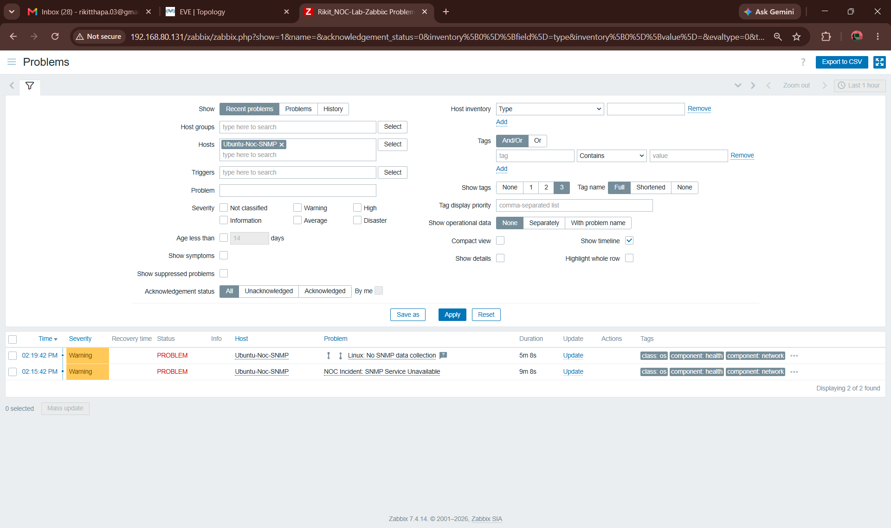
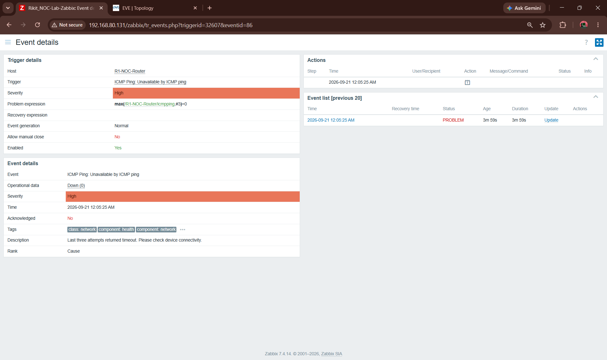
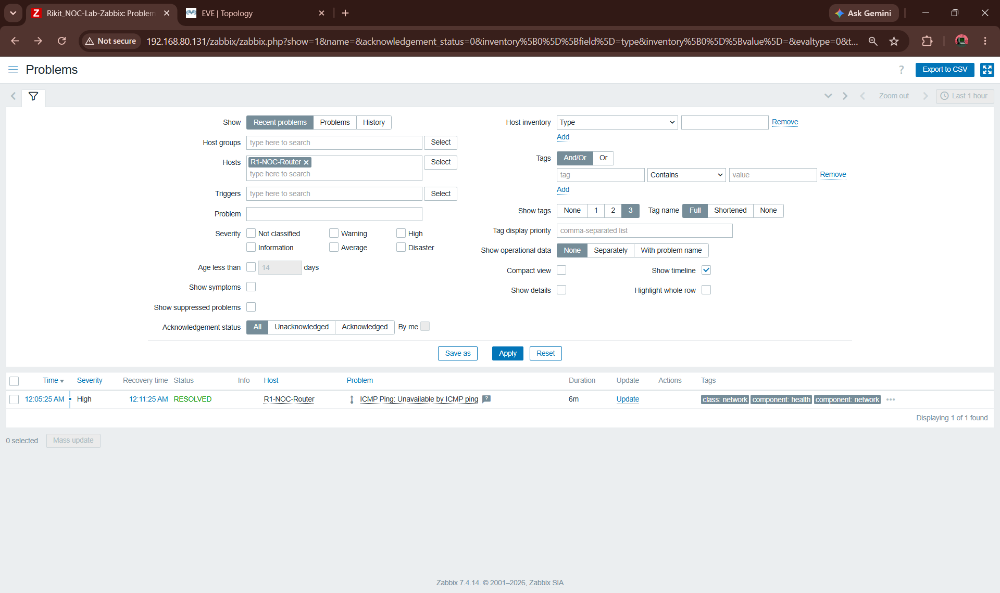

# NOC Infrastructure Monitoring & Incident Response Lab

A hands-on **NOC and infrastructure monitoring environment** built to demonstrate practical skills in **Zabbix, Linux administration, SNMP, ICMP monitoring, network troubleshooting, EVE-NG, and incident response**.

The environment was built from the ground up and used to monitor infrastructure, simulate failures, investigate alerts, restore services, and verify recovery.

> **Monitor → Detect → Investigate → Remediate → Verify → Document**

**Target roles:** IT Support · Service Desk · Junior NOC · Network Support · Infrastructure Support

---

## 🎯 What I Built

* Deployed **Ubuntu Server 24.04 LTS** as the monitoring platform
* Installed and configured **Zabbix 7.4.14**
* Configured **Zabbix Agent** for Linux host monitoring
* Implemented **SNMPv2c** monitoring using the `Linux by SNMP` template
* Built a simulated network environment in **EVE-NG**
* Configured **FRRouting** as a simulated network router
* Configured two routed endpoint networks
* Implemented **ICMP monitoring** for network-device availability
* Simulated infrastructure failures and investigated resulting alerts
* Restored failed services/devices and verified recovery

---

# 🏗️ Architecture

```text
                         Windows 11 Host
                      VMware Workstation Pro
                               │
                ┌──────────────┴──────────────┐
                │                             │
                ▼                             ▼
         Ubuntu-NOC                         EVE-NG
       192.168.80.131                    192.168.80.132
                │                             │
                ▼                             ▼
             Zabbix                    R1-NOC-Router
          Monitoring & Alerts           192.168.80.133
                                              │
                                      ┌───────┴───────┐
                                      ▼               ▼
                                NOC-Host01       NOC-Host02
                              192.168.100.10   192.168.101.10
```

### Monitoring Architecture

| System            | Method       | Purpose                         |
| ----------------- | ------------ | ------------------------------- |
| Ubuntu-Noc-Server | Zabbix Agent | Linux host monitoring           |
| Ubuntu-Noc-SNMP   | SNMPv2c      | Infrastructure monitoring       |
| R1-NOC-Router     | ICMP         | Network availability monitoring |

---

# 📡 Monitoring Implementation

### Linux Monitoring

Zabbix Agent was configured on Ubuntu Server to collect infrastructure metrics such as:

* CPU utilization
* Memory utilization
* Disk/filesystem information
* System information
* Network information
* Load and uptime

### SNMP Monitoring

A dedicated SNMP host was configured in Zabbix:

```text
Host: Ubuntu-Noc-SNMP
IP: 192.168.80.131
Protocol: SNMPv2c
Port: UDP/161
Template: Linux by SNMP
```

SNMP connectivity was independently validated with:

```bash
snmpwalk -v2c -c public 192.168.80.131 1.3.6.1.2.1.1
```

### Network Monitoring

R1-NOC-Router was monitored using ICMP for:

* Availability
* Packet loss
* Response time

This provided a practical network-device availability monitoring scenario.

---

# 🚨 Incident Response

The lab includes two controlled incidents designed to demonstrate a realistic monitoring and response workflow.

## 1. SNMP Service Failure

**Simulation**

```bash
sudo systemctl stop snmpd
```

**Investigation**

```bash
sudo -u zabbix snmpwalk -v2c -c public 192.168.80.131 1.3.6.1.2.1.1.1.0
```

The SNMP request timed out, confirming the monitoring failure.

**Detection**

Zabbix generated:

```text
Linux: No SNMP data collection
NOC Incident: SNMP Service Unavailable
Severity: Warning
```

The SNMP service was restored and polling was verified successfully.

**Demonstrates:** service monitoring → failure detection → investigation → remediation → verification.

---

## 2. Router Availability Failure

**Simulation**

`R1-NOC-Router` was stopped in EVE-NG.

**Detection**

Zabbix reported:

```text
ICMP Ping: Unavailable by ICMP ping
Severity: High
```

**Recovery**

The router was restarted and connectivity was verified:

```bash
ping -c 4 192.168.80.133
```

Zabbix subsequently recorded the incident as:

```text
RESOLVED
```

**Demonstrates:** network monitoring → outage detection → recovery → connectivity verification.

---

# 🔧 Troubleshooting Highlights

This project involved troubleshooting real configuration and deployment issues rather than only following a setup guide.

### SNMP Binding

Remote SNMP polling initially failed because `snmpd` was listening only on localhost. The configuration was investigated, the conflicting binding was removed, and remote SNMP polling was successfully restored.

### Zabbix Database Authentication

Zabbix initially reported that the server was not running despite the service being active. Log analysis identified a MySQL authentication/configuration issue. The database configuration was corrected and Zabbix processing was restored.

### Zabbix Template Conflict

The existing Ubuntu monitoring host encountered an inventory conflict when SNMP monitoring was added alongside the Agent configuration. The inherited template configuration was investigated, and a dedicated SNMP host was created to keep the monitoring configurations separated.

### EVE-NG Networking

Virtual networking issues initially prevented reliable connectivity between the EVE-NG environment and the host network. The VMware networking configuration was adjusted and connectivity was restored.

### Network Simulation

FRRouting was configured with two routed networks:

```text
192.168.100.0/24
192.168.101.0/24
```

Connectivity between the simulated endpoints was verified through R1.

---

# 🌐 Network Details

| Device        | IP Address          | Role               |
| ------------- | ------------------- | ------------------ |
| Ubuntu-NOC    | `192.168.80.131/24` | Monitoring server  |
| EVE-NG        | `192.168.80.132`    | Network simulation |
| R1 Management | `192.168.80.133/24` | Router management  |
| R1 Network 1  | `192.168.100.1/24`  | Host01 gateway     |
| R1 Network 2  | `192.168.101.1/24`  | Host02 gateway     |
| NOC-Host01    | `192.168.100.10/24` | Simulated endpoint |
| NOC-Host02    | `192.168.101.10/24` | Simulated endpoint |

---

# 🛠️ Technology Stack

**Monitoring**

`Zabbix 7.4.14` · `Zabbix Agent` · `SNMPv2c` · `ICMP`

**Linux**

`Ubuntu Server 24.04` · `SSH` · `Bash` · `APT` · `systemd`

**Networking**

`TCP/IP` · `IPv4` · `DNS` · `DHCP` · `ICMP` · `UDP` · `SNMP` · `Routing`

**Virtualization & Simulation**

`VMware Workstation Pro` · `EVE-NG Pro` · `FRRouting`

**Backend**

`MySQL` · `Apache`

---

# 🧠 Skills Demonstrated

* Infrastructure monitoring
* Linux administration
* Zabbix configuration
* SNMP monitoring
* ICMP monitoring
* Network troubleshooting
* Service troubleshooting
* Incident detection
* Incident investigation
* Service recovery
* Network recovery
* Connectivity verification
* Log analysis
* Virtual network configuration
* Technical documentation

---

# 📸 Project Evidence

The screenshots below document the actual implementation, monitoring configuration, live data collection, and controlled incident-response testing.

### 01 — Ubuntu Network Configuration


**Demonstrates:** Ubuntu Server network interface and connectivity configuration.

---

### 02 — SSH Service


**Demonstrates:** SSH service configuration for remote Linux administration.

---

### 03 — SNMP Service


**Demonstrates:** SNMP service configuration and operational status.

---

### 04 — Zabbix Dashboard


**Demonstrates:** Successful Zabbix deployment and web-interface access.

---

### 05 — Ubuntu Host Monitoring


**Demonstrates:** Zabbix Agent-based monitoring of the Ubuntu host.

---

### 06 — EVE-NG Environment


**Demonstrates:** EVE-NG environment used to build the simulated NOC network.

---

### 07 — NOC Network Topology


**Demonstrates:** Simulated router and endpoint topology used for network monitoring and testing.

---

### 08 — Successful SNMP Polling


**Demonstrates:** Successful remote SNMPv2c communication and data retrieval.

---

### 09 — Zabbix SNMP Host Configuration


**Demonstrates:** Dedicated Ubuntu SNMP host configured in Zabbix with the `Linux by SNMP` template.

---

### 10 — SNMP Live Metrics


**Demonstrates:** Live infrastructure metrics collected through SNMP.

---

### 11 — SNMP Incident Detected



**Demonstrates:** Zabbix detecting the controlled SNMP service failure.

---

### 12 — Router Outage Detected



**Demonstrates:** Zabbix detecting loss of ICMP connectivity after the simulated router outage.

---

### 13 — Router Recovery



**Demonstrates:** Connectivity restored and the Zabbix incident transitioning to **RESOLVED**.

---

# 💼 Why This Project Matters

This project demonstrates the operational workflow used in infrastructure and NOC environments:

> **Deploy → Configure → Monitor → Detect → Investigate → Restore → Verify**

It provides hands-on evidence of working with **Linux systems, infrastructure monitoring, network availability, troubleshooting, and incident response** rather than only theoretical knowledge.

---

## 👨‍💻 Portfolio Focus

**IT Support · Service Desk · Junior NOC · Network Support · Infrastructure Support**

**Core technologies:**
`Linux` · `Zabbix` · `SNMP` · `ICMP` · `EVE-NG` · `FRRouting` · `Networking` · `Incident Response`
