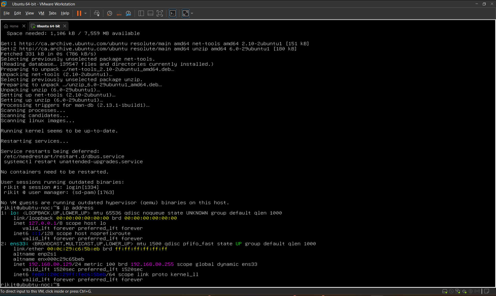
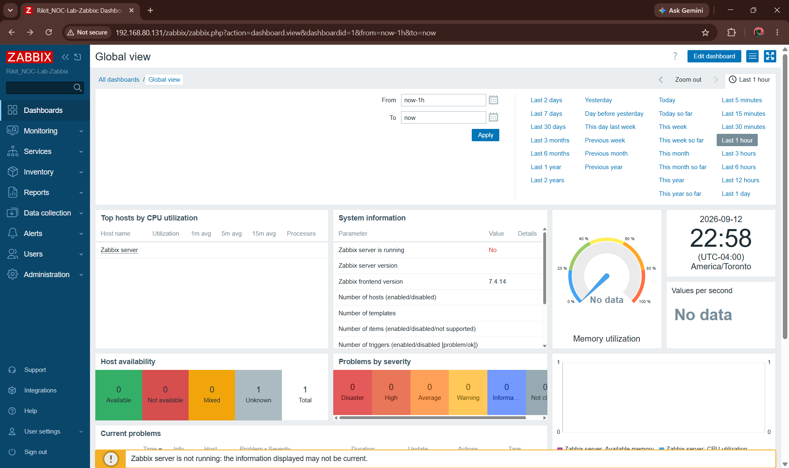
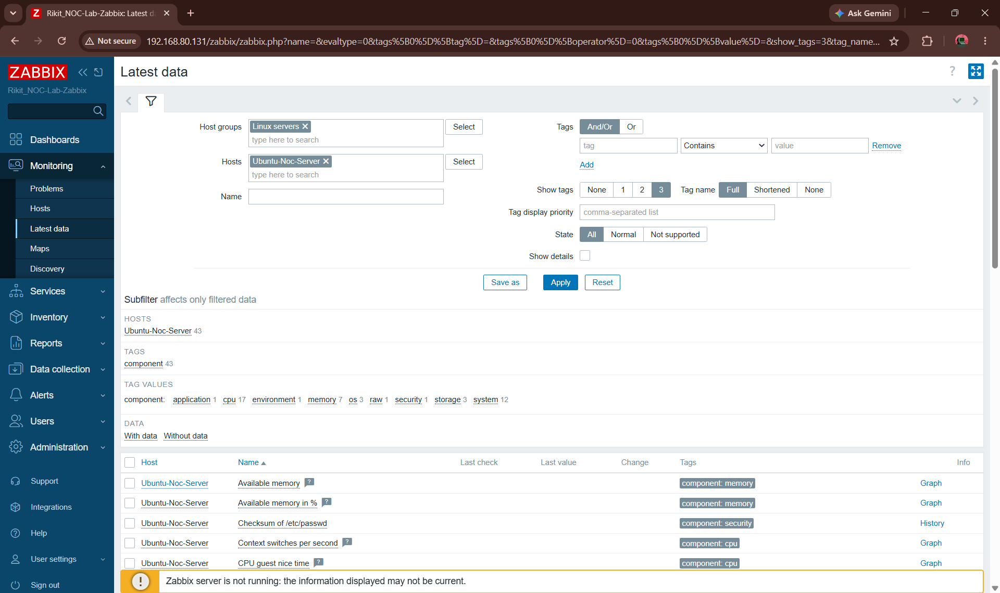
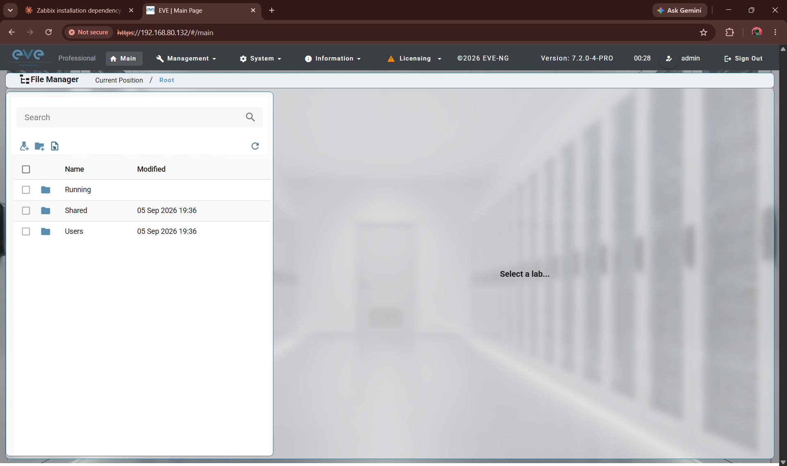
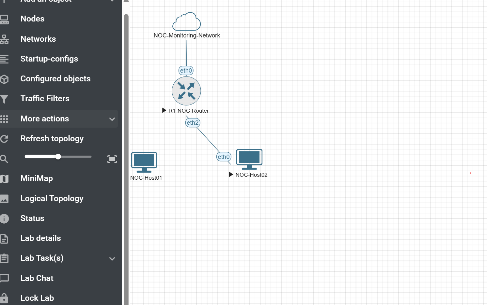
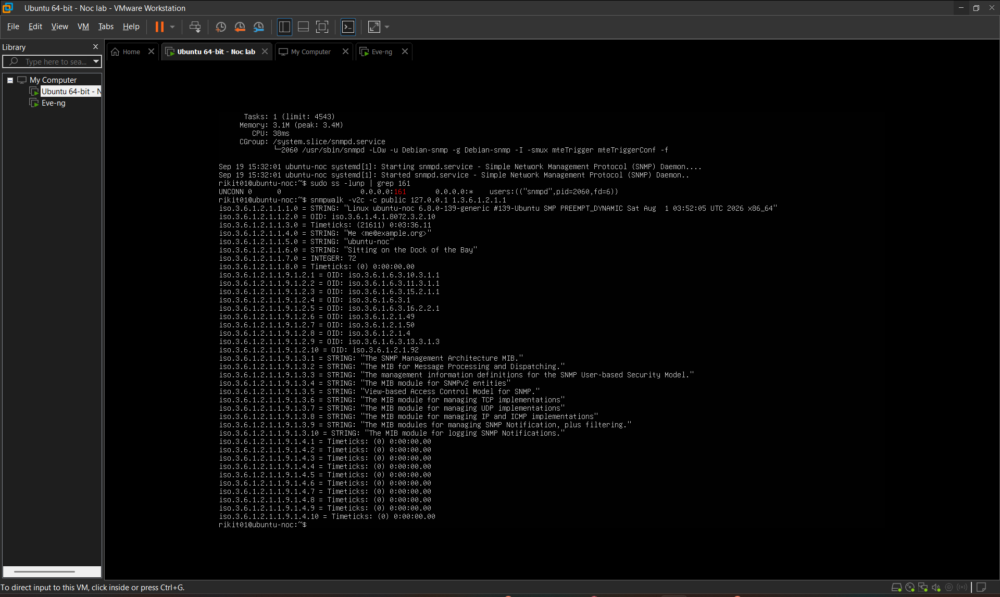
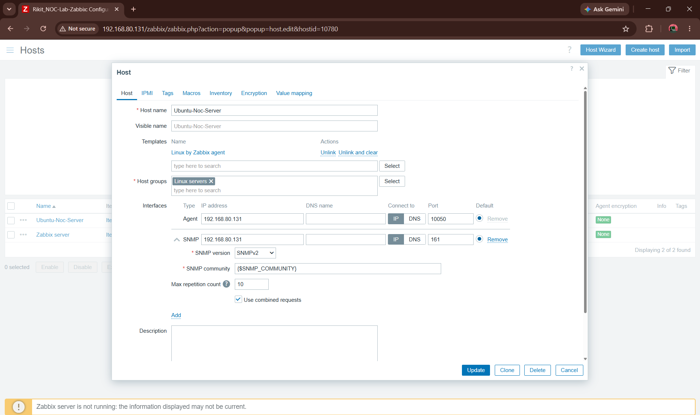
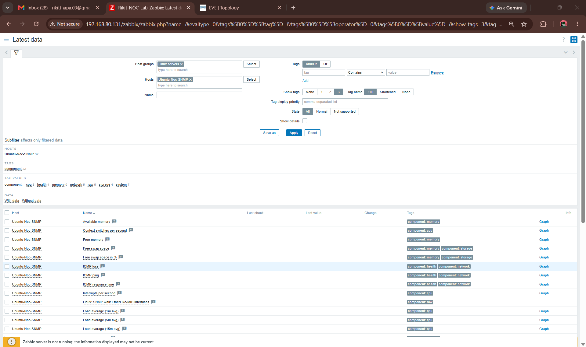

# NOC Infrastructure Monitoring & Incident Response Lab

A hands-on **NOC simulation project** demonstrating practical skills in **infrastructure monitoring, Linux administration, SNMP, network troubleshooting, virtual networking, and incident response**.

Built end-to-end using **Ubuntu Server 24.04 LTS, Zabbix 7.4, EVE-NG, VMware Workstation Pro, and Wireshark**.

The project follows a practical operational workflow:

> **Monitor → Detect → Triage → Investigate → Remediate → Verify → Document**

---

## 🎯 Project Objective

Build and operate a small simulated NOC environment capable of:

* Monitoring infrastructure and network services
* Collecting host and SNMP metrics
* Detecting availability and performance issues
* Investigating technical incidents
* Performing structured troubleshooting and remediation
* Verifying service recovery
* Documenting incidents and technical findings

**Target roles:**

**IT Support · Service Desk · Junior NOC · Network Support · Infrastructure Support**

---

# 🏗️ Architecture

```text
                         Windows 11 Host
                      VMware Workstation Pro
                               │
              ┌────────────────┴────────────────┐
              │                                 │
              ▼                                 ▼
       Ubuntu Server 24.04                   EVE-NG
          Ubuntu-NOC                       Network Lab
       192.168.80.131                          │
              │                         ┌──────┴──────┐
      ┌───────┼────────┐                │             │
      ▼       ▼        ▼                ▼             ▼
   Zabbix   MySQL    Apache        R1-NOC-Router  SW1-NOC-Switch
      │                                      │             │
      │                                      └──────┬──────┘
      │                                             │
      ▼                                       NOC-Host01
  SNMP Monitoring                              NOC-Host02
      │
      ▼
 Metrics / Alerts
      │
      ▼
 Incident Investigation
      │
      ▼
   Wireshark
```

### Management Network

| System     | Address          | Purpose                         |
| ---------- | ---------------- | ------------------------------- |
| Ubuntu-NOC | `192.168.80.131` | Zabbix / SNMP monitoring server |
| EVE-NG     | `192.168.80.132` | Network simulation platform     |
| SNMP       | UDP `161`        | Infrastructure monitoring       |

---

# 🛠️ Technology Stack

| Category           | Technologies                 |
| ------------------ | ---------------------------- |
| OS                 | Ubuntu Server 24.04 LTS      |
| Monitoring         | Zabbix 7.4                   |
| Network Monitoring | SNMP / SNMPv2c               |
| Database           | MySQL                        |
| Web Server         | Apache 2                     |
| Network Simulation | EVE-NG Pro 7.2.0-4-PRO       |
| Packet Analysis    | Wireshark                    |
| Virtualization     | VMware Workstation Pro       |
| Administration     | SSH, Bash, APT, systemd      |
| Networking         | TCP/IP, DNS, DHCP, UDP, SNMP |

---

# ✅ Completed Implementation

## Linux Monitoring Server

* Deployed **Ubuntu Server 24.04 LTS**
* Configured network addressing and connectivity
* Verified DNS resolution
* Configured SSH remote administration
* Installed **Zabbix Server 7.4**
* Configured **MySQL** database backend
* Configured **Apache** web frontend
* Installed and configured **Zabbix Agent**
* Verified live CPU, memory, and disk monitoring
* Installed and configured **SNMP**
* Verified SNMP daemon operation
* Verified UDP/161 listening
* Successfully performed local SNMP polling
* Successfully performed network SNMP polling

---

## 📡 Zabbix SNMP Monitoring

A dedicated Zabbix host was created for SNMP monitoring:

```text
Host: Ubuntu-Noc-SNMP
IP: 192.168.80.131
SNMP: UDP/161
Version: SNMPv2c
Template: Linux by SNMP
```

Zabbix is successfully collecting SNMP-based monitoring data including:

* CPU metrics
* Memory metrics
* System information
* Load averages
* Uptime
* ICMP availability
* Network-related metrics
* Storage/filesystem information

### SNMP Verification

Network-level SNMP connectivity was verified using:

```bash
snmpwalk -v2c -c public 192.168.80.131 1.3.6.1.2.1.1
```

The successful response returned standard SNMP system information including:

* System description
* System uptime
* System name
* SNMP system OIDs

This verified that the SNMP service is reachable over the network and can be monitored by Zabbix.

---

# 🌐 EVE-NG Network Environment

Deployed **EVE-NG Pro 7.2.0-4-PRO** as the network simulation environment.

### Completed

* EVE-NG deployment
* Virtual networking configuration
* Management network configuration
* NAT + DHCP configuration
* Web interface access
* NOC topology creation
* Router node
* Switch node
* Two host nodes

### Current Topology

```text
              Cloud0 / Management
                       │
                       ▼
                R1-NOC-Router
                       │
                       ▼
                SW1-NOC-Switch
                  /          \
                 /            \
        NOC-Host01          NOC-Host02
```

The topology provides a simulated network environment for future availability, connectivity, and network incident scenarios.

---

# 🔧 Troubleshooting Performed

This project includes **real troubleshooting performed during deployment**, not just installation screenshots.

## SNMP Localhost Binding Issue

**Problem**

Remote SNMP polling initially failed because the SNMP daemon was restricted to localhost:

```text
127.0.0.1:161
[::1]:161
```

**Investigation**

Checked:

* `snmpd` service status
* UDP listening sockets
* `/etc/snmp/snmpd.conf`
* SNMP configuration entries

Identified a conflicting `agentaddress` configuration.

**Resolution**

Removed the conflicting localhost binding and restarted the SNMP service.

**Verification**

Confirmed the daemon was listening on:

```text
0.0.0.0:161
```

Network SNMP polling then succeeded against:

```text
192.168.80.131
```

---

## EVE-NG Wi-Fi / Bridged Connectivity Issue

**Problem**

EVE-NG was initially unreachable when using bridged networking over Wi-Fi.

**Investigation**

Tested VM networking and host-to-VM connectivity.

**Resolution**

Reconfigured the EVE-NG VM to:

```text
NAT + DHCP
```

Web access was subsequently verified.

---

## Zabbix Database Initialization

**Problem**

Initial database initialization and schema configuration required troubleshooting.

**Investigation**

Reviewed:

* MySQL configuration
* Database privileges
* Database state
* Zabbix schema initialization

**Resolution**

Corrected the database configuration and completed the required schema initialization.

---

## Zabbix SNMP Template Conflict

**Problem**

The existing agent-monitored Ubuntu host could not directly inherit the `Linux by SNMP` template because of overlapping discovery and inventory definitions.

**Investigation**

Reviewed inherited Zabbix items, inventory fields, graphs, and low-level discovery rules.

**Resolution**

Kept the existing agent-monitored host unchanged and created a dedicated SNMP host:

```text
Ubuntu-Noc-SNMP
```

with:

```text
Linux by SNMP
```

This separated agent-based and SNMP-based monitoring and allowed SNMP monitoring to operate without disrupting the existing host configuration.

---

# 📊 Monitoring Workflow

The completed environment is designed around the following NOC workflow:

```text
Infrastructure
      ↓
Monitoring
      ↓
Metrics / Availability
      ↓
Alert
      ↓
Triage
      ↓
Investigation
      ↓
Root Cause
      ↓
Remediation
      ↓
Recovery Verification
      ↓
Incident Documentation
```

The monitoring foundation is currently operational.

The next phase will demonstrate the complete incident-response workflow through controlled incidents.

---

# 🚨 Incident Response Plan

The incident-response phase will simulate realistic NOC events such as:

### Incident 1 — Host Availability

Simulate a monitored host becoming unavailable.

```text
Detection
   ↓
Zabbix Problem
   ↓
Triage
   ↓
Connectivity Investigation
   ↓
Root Cause
   ↓
Remediation
   ↓
Recovery Verification
```

### Incident 2 — SNMP Service Failure

Simulate an SNMP monitoring failure.

```text
Detection
   ↓
Zabbix Alert
   ↓
SNMP Investigation
   ↓
Service Troubleshooting
   ↓
Remediation
   ↓
Verify Monitoring Recovery
```

### Additional Scenarios

Potential additional incidents include:

* Packet loss
* High CPU utilization
* High memory utilization
* Network interface failure
* DNS resolution failure
* DHCP failure
* Service availability failure
* Network connectivity problems

**Wireshark** will be used where packet-level investigation provides useful evidence.

---

# 📸 Project Evidence

The implementation is supported by screenshots documenting the actual lab build.

### 01 — Ubuntu Network Configuration


Verified Ubuntu network configuration and connectivity.

### 02 — SSH Service



Verified SSH availability for remote Linux administration.

### 03 — SNMP Service


Verified the SNMP daemon running on Ubuntu.

### 04 — Zabbix Dashboard



Verified successful Zabbix deployment and frontend access.

### 05 — Live Host Monitoring



Verified Zabbix collection of live host metrics.

### 06 — EVE-NG Web Interface



Verified EVE-NG deployment and web access.

### 07 — EVE-NG NOC Topology



Shows the simulated NOC network topology.

### 08 — Successful Network SNMP Polling



Demonstrates successful remote SNMPv2c polling.

### 09 — Zabbix SNMP Host Configuration



Shows the dedicated SNMP-monitored host and `Linux by SNMP` template configuration.

### 10 — Zabbix SNMP Live Metrics



Shows Zabbix successfully collecting SNMP monitoring data.

---

# 🧠 Skills Demonstrated

### Linux Administration

* Ubuntu Server
* Bash
* APT
* systemd
* SSH
* Linux networking
* Service troubleshooting

### Infrastructure Monitoring

* Zabbix Server
* Zabbix Agent
* SNMP
* SNMPv2c
* Host monitoring
* Availability monitoring
* CPU/memory/storage monitoring
* SNMP polling

### Networking

* TCP/IP
* DNS
* DHCP
* UDP
* SNMP
* Network troubleshooting
* Virtual networking
* EVE-NG

### Troubleshooting

* Fault isolation
* Root-cause analysis
* Service troubleshooting
* Configuration analysis
* Network troubleshooting
* Technical evidence collection
* Recovery verification

### Incident Response

* Alert triage
* Incident investigation
* Root-cause analysis
* Remediation
* Recovery verification
* Incident documentation

---

# 📈 Project Progress

## Monitoring Infrastructure

* [x] Ubuntu Server 24.04 LTS
* [x] Network configuration
* [x] DNS/connectivity verification
* [x] SSH
* [x] Zabbix Server 7.4
* [x] MySQL
* [x] Apache
* [x] Zabbix Agent
* [x] Live host metrics
* [x] SNMP installation
* [x] SNMP configuration
* [x] Local SNMP polling
* [x] Network SNMP polling

## EVE-NG Network Lab

* [x] EVE-NG deployment
* [x] Virtual networking
* [x] Management network
* [x] NOC topology
* [x] Router node
* [x] Switch node
* [x] Host nodes

## Zabbix SNMP Monitoring

* [x] Add SNMP-monitored host
* [x] Configure SNMP interface
* [x] Apply `Linux by SNMP` template
* [x] Verify live SNMP metrics
* [ ] Configure/validate incident triggers
* [ ] Generate Zabbix Problems/Alerts

## Incident Response

* [ ] Simulate NOC incident
* [ ] Detect incident through monitoring
* [ ] Perform technical investigation
* [ ] Capture Wireshark evidence
* [ ] Identify root cause
* [ ] Remediate incident
* [ ] Verify recovery
* [ ] Document incident report

## Final Documentation

* [ ] Complete incident evidence
* [ ] Add incident reports
* [ ] Finalize architecture
* [ ] Finalize README
* [ ] Mark project complete

---

# 📊 Current Status

**🟡 In Progress**

### Monitoring Foundation

**Complete**

Ubuntu Server + Zabbix + MySQL + Apache + SSH + SNMP

### Network Simulation

**Complete**

EVE-NG + virtual networking + NOC topology

### SNMP Monitoring

**Complete**

SNMP configuration + successful network polling + Zabbix SNMP host + live SNMP metrics

### Incident Response

**Next Phase**

Zabbix alerting → incident simulation → investigation → remediation → recovery → documentation

---

# 💼 Why This Project Matters

This project demonstrates practical operational experience beyond simply installing monitoring software.

It shows the ability to:

* Build a Linux monitoring environment
* Configure and troubleshoot SNMP
* Deploy a virtual network environment
* Configure infrastructure monitoring
* Troubleshoot service and connectivity problems
* Perform structured root-cause analysis
* Collect technical evidence
* Follow an operational incident workflow
* Verify recovery
* Document technical findings

These skills are directly applicable to entry-level:

**IT Support · Service Desk · Junior NOC · Network Support · Infrastructure Support**

---

# 👨‍💻 About

**Rikit Thapa**

Computer Systems Networking Technician — Loyalist College
Dean's List

**Career Focus:** IT Support · Service Desk · Junior NOC · Network Support · Infrastructure Support

### Other Hands-On Projects

* Windows IT Support & Active Directory Lab
* Cisco Campus Network Design
* IT Service Desk & Incident Management Lab
* NOC Infrastructure Monitoring & Incident Response Lab

---

## 📌 Project Status

**🟡 In Progress**

The monitoring infrastructure, SNMP configuration, Zabbix SNMP monitoring, EVE-NG environment, and NOC topology are operational.

The next development phase focuses on **Zabbix alerting, controlled NOC incidents, technical investigation, Wireshark analysis, remediation, recovery verification, and incident documentation.**

> **Build → Monitor → Detect → Investigate → Resolve → Verify → Document**
